# دليل نظام إدارة دورة حياة العقد والتنبيهات الذكية (Contract Lifecycle & Smart Alerts)
### شركة رواسي عدن للهندسة والمقاولات

---

## 1. المقدمة والهدف المؤسسي

يمثل العقد الهندسي الوثيقة المرجعية الحاكمة للعلاقة بين شركة المقاولات والمالك أو جهة الإشراف. يهدف هذا النظام إلى تحويل العقود من مجرد "بيانات أولية ثابتة" إلى **دورة مستندية تفاعلية متكاملة (Interactive Contract Lifecycle)** تخضع للرقابة الصارمة والتنبيهات الذكية الاستباقية لتجنب غرامات التأخير وتأخر المستخلصات وضياع محتجزات الضمان.

---

## 2. مراحل دورة حياة العقد العشر (The 10 Lifecycle Stages)

يمر العقد الهندسي بعشر مراحل تسلسلية موثقة بختم رقمي مشفر (SHA-256):

```mermaid
graph LR
    A[1. مسودة draft] --> B[2. مراجعة قانونية under_review]
    B --> C[3. اعتماد مالي approved_finance]
    C --> D[4. توقيع رسمي signed]
    D --> E[5. سارٍ وتنفيذ active]
    E --> F[6. تعديل أوامر تغيير amended]
    F --> G[7. تمديد زمني extended]
    G --> H[8. مستخلصات جارية in_ipc]
    H --> I[9. تسوية ختامية in_settlement]
    I --> J[10. مغلق نهائياً closed]
```



| # | المرحلة (Stage) | التسمية العربية | الوصف والإجراءات الرقابية |
|---|---|---|---|
| 1 | `draft` | مسودة أولية | إعداد مسودة العقد، مراجعة البنود والأسعار التقديرية. |
| 2 | `under_review` | قيد المراجعة القانونية | تدقيق الشروط التعاقدية العامة والخاصة وشروط الفيديك (FIDIC). |
| 3 | `approved_finance` | اعتماد مالي وموازنة | التأكد من الملاءة المالية للمشروع والمصادقة على خطة التمويل. |
| 4 | `signed` | موقّع رسمياً | توقيع الطرفين وتوليد بصمة التوثيق الرقمية المشفرة (SHA-256). |
| 5 | `active` | سارٍ وقيد التنفيذ | تدشين الموقع الميداني، تسليم الموقع، وتفعيل المشروع بالنظام. |
| 6 | `amended` | معدل بأوامر تغيير | اعتماد ملاحق إضافية وأوامر تغيير (Variation Orders - VO). |
| 7 | `extended` | ممدد رسمياً | اعتماد تمديد زمني معتمد دون تطبيق غرامات تأخير. |
| 8 | `in_ipc` | مستخلصات جارية | مرحلة التنفيذ المالي ورفع شهادات الدفع المرحلية الدورية. |
| 9 | `in_settlement` | تسوية ختامية | الحساب الختامي، الاستلام الابتدائي، وتدقيق الكميات المنفذة. |
| 10| `closed` | مغلق نهائياً | الإفراج عن محتجز الضمان بعد انقضاء فترة الصيانة (DLP). |

---

## 3. محرك التنبيهات الذكية الخمسة (Smart Alerts Engine)

يعمل المحرك بنظام المراقبة المستمرة (Auto-Scan Scheduler) لفحص 5 مخاطر رئيسية:

### 1. تنبيه انتهاء العقد (Contract Expiry Alert):
- **معيار الفحص:** مقارنة تاريخ اليوم بتاريخ انتهاء العقد (`end_date`).
- **مستويات الخطورة:**
  - `info`: متبقي $\le$ 90 يوماً (بدء التخطيط والتقييم الزمني).
  - `warning`: متبقي $\le$ 30 يوماً (طلب تمديد أو تكثيف الورديات).
  - `critical`: متبقي $\le$ 7 أيام أو منتهٍ فعلياً دون إغلاق رسمي.

### 2. تنبيه موعد المستخلص الدوري (IPC Due Alert):
- **معيار الفحص:** احتساب الأيام المنقضية منذ آخر مستخلص معتمد استناداً لـ `ipc_cycle_days` (افتراضي 30 يوماً).
- **الشرط الذكي:** لا يُطلق النظام تنبيهاً إذا لم يتغير مؤشر الإنجاز (POC) أو لم توجد بنود كميات (BOQ) منفذة غير مفوترة.

### 3. تنبيه استحقاق واسترداد الدفعة المقدمة (Advance Payment Amortization):
- **معيار الفحص:** متابعة رصيد الدفعة المقدمة المتبقي غير المسترد (`advance_payment_amount - total_deducted`).
- **الإجراء:** التنبيه بنسبة الاستقطاع الإلزامية الواجب خصمها من المستخلص القادم.

### 4. تنبيه الإفراج عن محتجز الضمان (Retention Due Alert):
- **معيار الفحص:** متابعة مبالغ ضمان حسن التنفيذ المحتجزة (`retention_pct`) وتاريخ الاستحقاق (`retention_due_date`).
- **الهدف:** استرداد مستحقات الشركة فور انتهاء فترة إشعار العيوب والصيانة (DLP).

### 5. تنبيه غرامات التأخير التعاقدية (Delay Penalty Alert):
- **معيار الفحص:** في حال تجاوز المدة الزمنية وعدم اكتمال المشروع بنسبة 100%:
  $$\text{غرامة التأخير} = \min(\text{أيام التأخير} \times \text{penalty\_per\_day}, \text{max\_penalty\_pct} \times \text{قيمة العقد})$$
- **الهدف:** إشعار الإدارة فوراً بحجم المخاطر المالية المعرضة للخصم (`amount_at_risk`).

---

## 4. التوثيق الجنائي والرقمي (Cryptographic Signature Verification)

عند توقيع العقد أو اعتماده رسمياً، يقوم النظام بتوليد هاش مشفر لا يمكن تزويره:
$$\text{Signature Hash} = \text{SHA256}(ID : \text{ContractNo} : \text{ContractValue} : \text{FirstParty} : \text{SecondParty} : \text{Date})$$
يُخزن الهاش في قاعدة البيانات ليُستخدم لاحقاً كمرجع قطعي لمطابقة النسخة الموقعة.

---

## 5. واجهات برمجة التطبيقات (API Reference)

### 1. نقل العقد إلى مرحلة جديدة:
```http
POST /api/contracts/1/transition
Authorization: Bearer <TOKEN>
Content-Type: application/json

{
  "stage": "signed",
  "signature_date": "2026-10-06",
  "approval_notes": "تم توقيع العقد رسمياً بمقر الشركة"
}
```

### 2. جلب السجل التاريخي لمراحل العقد:
```http
GET /api/contracts/1/lifecycle
Authorization: Bearer <TOKEN>
```

### 3. جلب العقود المقاربة على الانتهاء:
```http
GET /api/contracts/expiring?days=30
Authorization: Bearer <TOKEN>
```

### 4. لوحة ملخص التنبيهات الذكية:
```http
GET /api/contracts/alerts/dashboard?severity=critical
Authorization: Bearer <TOKEN>
```

### 5. الإقرار بمتابعة تنبيه:
```http
POST /api/contracts/1/alerts/15/ack
Authorization: Bearer <TOKEN>
Content-Type: application/json

{
  "notes": "تم إشعار مدير المشروع وجارٍ رفع طلب تمديد للمالك"
}
```

### 6. بث الإشعارات الحية المباشرة (Server-Sent Events):
```http
GET /api/contracts/alerts/stream
```
تتيح لواجهة المتصفح استقبال تنبيهات العقود فور حدوثها في الوقت الحقيقي.
