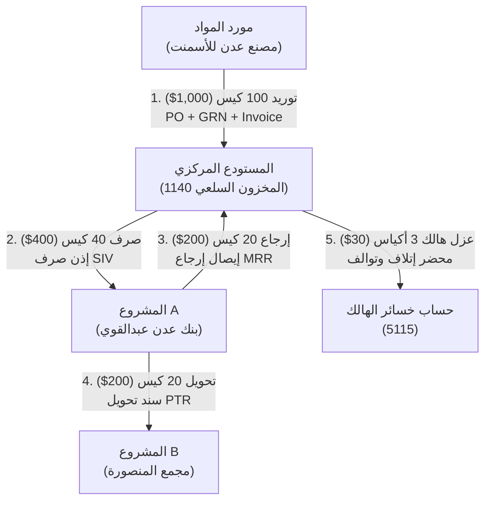

# 📋 الدليل الشامل لاختبار الدورة المستندية للمواد ومحرك ربحية المشاريع
### نظام رواسي عدن للهندسة والمقاولات (Rawasi Aden ERP)

---

## 📑 جدول المحتويات
1. [المقدمة والأهداف الرقابية](#1-المقدمة-والأهداف-الرقابية)
2. [الدورة المستندية الكاملة للمواد (Material Lifecycle)](#2-الدورة-المستندية-الكاملة-للمواد)
3. [القيود المحاسبية التفصيلية المزدوجة](#3-القيود-المحاسبية-التفصيلية-المزدوجة)
4. [مصفوفة المطابقة الرقابية وميزان المراجعة النهائي](#4-مصفوفة-المطابقة-الرقابية-وميزان-المراجعة-النهائي)
5. [مركز ربحية المشاريع اللحظي (Real-time Profitability) وفق IFRS 15](#5-مركز-ربحية-المشاريع-اللحظي)
6. [طريقة تشغيل الاختبار والتحقق الآلي](#6-طريقة-تشغيل-الاختبار-والتحقق-الآلي)

---

## 1. المقدمة والأهداف الرقابية

تعتبر إدارة المواد في شركات المقاولات والهندسة العصب الأساسي للرقابة على تكاليف المشاريع؛ حيث تمثل المواد الإنشائية عادة ما بين **50% إلى 65%** من إجمالي تكاليف عقود الإنشاءات.

يهدف هذا الاختبار الرقابي والمحاسبي إلى إثبات:
1. **سلامة الدورة المستندية الثلاثية:** (طلب الشراء PR → أمر الشراء PO → إذن الاستلام المخزني GRN → فاتورة الشراء الآجلة Purchase Invoice).
2. **الربط المحاسبي اللحظي (Continuous Inventory & Perpetual Method):** توليد القيود اليومية التلقائية المتزنة فور كل حركة مخزنية.
3. **الفصل الدقيق لتكاليف المشاريع:** عزل تكلفة كل مشروع في مركز تكلفته المستقل دون اختلاط الأرصدة.
4. **التوافق التام لميزان المراجعة:** التحقق من توازن إجمالي المدين والدائن في كل لحظة.

---

## 2. الدورة المستندية الكاملة للمواد

تم تنفيذ واختبار السيناريو الميداني الكامل عبر سكريبت الاختبار المعتمد [`tests/test_material_flow.js`](file:///c:/Users/a.ba3baid/رواسي عدن/tests/test_material_flow.js) وفق الخطوات الخمس التالية:



### تفاصيل المراحل التنفيذية:

#### الخطوة 1: الشراء والتوريد المخزني
* **العملية:** شراء **100 كيس إسمنت بورتلاندي** بسعر **10$ للكيس** (الإجمالي: **1,000$**) من المورد **مصنع عدن للأسمنت** بالأجل.
* **المستندات الصادرة:**
  * أمر شراء معتمد `PO-CEM-XXXXX`.
  * إذن استلام مخزني `GRN-CEM-XXXXX` مع محضر الفحص المخبري والقبول.
  * فاتورة شراء مورد `PUR-CEM-XXXXX`.
* **الأثر المخزني:** زيادة رصيد المستودع المركزي بـ **100 كيس**.

#### الخطوة 2: صرف المواد للمشروع A
* **العملية:** صرف **40 كيس إسمنت** للمشروع A (**مشروع فرع بنك عدن عبدالقوي**) لصب القواعد الخرسانية.
* **المستند الصادر:** إذن صرف مخزني `SIV-CEM-XXXXX` موقع من مهندس الموقع وأمين المخزن.
* **الأثر المخزني والمالي:** 
  * انخفاض رصيد المستودع إلى **60 كيس** (600$).
  * زيادة التكلفة المباشرة للمشروع A بمقدار **400$**.

#### الخطوة 3: إرجاع فائض المواد للمستودع
* **العملية:** بعد انتهاء مرحلة الصب، تم حصر فائض المواد وإرجاع **20 كيس إسمنت صالحة للاستخدام** إلى المستودع.
* **المستند الصادر:** إيصال إرجاع مواد للمخزن `MRR-CEM-XXXXX` بعد فحص الجودة (QC Pass).
* **الأثر المخزني والمالي:**
  * ارتفاع رصيد المستودع المركزي إلى **80 كيس** (800$).
  * تخفيض تكلفة المشروع A بمقدار **200$** (صافي تكلفة المشروع A يصبح **200$**).

#### الخطوة 4: تحويل المواد بين المشاريع
* **العملية:** وجود حاجة عاجلة بالمشروع B (**مشروع مجمع المنصورة التجاري**) لتغطية مرحلة صب مستعجلة؛ فتم تحويل **20 كيس إسمنت** من موقع المشروع A إلى المشروع B.
* **المستند الصادر:** سند تحويل مواد بين المشاريع `PTR-CEM-XXXXX` مع تطبيق الرقابة الثنائية (Maker-Checker).
* **الأثر المالي:** 
  * تخفيض تكلفة المشروع المصدر A بمقدار **200$**.
  * تحميل تكلفة المشروع المستلم B بمقدار **200$**.

#### الخطوة 5: تطبيق نسبة الهالك وتوالف التخزين
* **العملية:** رصد تحجر وتلف **3 أكياس إسمنت** (ما يعادل نسبة تلف مقدرة 2-3% ناتجة عن عوامل الرطوبة).
* **المستند الصادر:** محضر حجر وإتلاف مواد `SCRAP-CEM-XXXXX` معتمد من لجنة السلامة والرقابة.
* **الأثر المخزني والمالي:**
  * انخفاض رصيد المستودع من **80 كيس** إلى **77 كيس** صالح للاستخدام (بقيمة **770$**).
  * إثبات خسائر التوالف بحساب الأرباح والخسائر التشغيلية بمقدار **30$**.

---

## 3. القيود المحاسبية التفصيلية المزدوجة

تطبيقا لقواعد المحاسبة القانونية ونظام القيد المزدوج الإلزامي، ولدت العمليات القيود اليومية التالية في دفتر الأستاذ العام:

| رقم القيد | البيان المحاسبي | الحساب المدين (Dr.) | الحساب الدائن (Cr.) | المبلغ ($) |
|---|---|---|---|---|
| **JV-01** | رصيد تشغيلي افتتاحي مخصص للمشروع A ممول من رأس المال | **5110** (تكلفة المشروع A) | **3101** (رأس المال وتمويل المشاريع) | 200.00 |
| **JV-02** | إثبات توريد 100 كيس إسمنت بموجب GRN وفاتورة المورد | **1140** (المخزون السلعي) | **2110** (الموردون - مصنع عدن للأسمنت) | 1,000.00 |
| **JV-03** | صرف 40 كيس إسمنت للمشروع A بموجب إذن الصرف SIV | **5110** (تكلفة المشروع A) | **1140** (المخزون السلعي) | 400.00 |
| **JV-04** | إرجاع 20 كيس إسمنت وتخفيض تكلفة المشروع A بموجب MRR | **1140** (المخزون السلعي) | **5110** (تكلفة المشروع A) | 200.00 |
| **JV-05** | تحويل تكلفة 20 كيس إسمنت من المشروع A إلى المشروع B بموجب PTR | **5110** (تكلفة المشروع B) | **5110** (تكلفة المشروع A) | 200.00 |
| **JV-06** | إثبات هالك 3 أكياس إسمنت وتخفيض المخزون بموجب محضر الإتلاف | **5115** (خسائر وتوالف المخزون) | **1140** (المخزون السلعي) | 30.00 |

---

## 4. مصفوفة المطابقة الرقابية وميزان المراجعة النهائي

تم فحص ومطابقة كافة الحسابات عبر دالة [`verifyFullReconciliation()`](file:///c:/Users/a.ba3baid/رواسي عدن/tests/test_material_flow.js):

### التقرير الرقابي المعتمد الصادر من النظام:
```text
┌────────────────────────────────────────────────┐
│ رصيد المخزون المتوقع: 77 كيس = 770$           │
│ رصيد حساب المخزون (1140): 770$                │
│ رصيد المورد: 1,000$                           │
│ تكلفة المشروع A: 200$                         │
│ تكلفة المشروع B: 200$                         │
│ خسائر الهالك: 30$                             │
│ ميزان المراجعة: متوازن ✓                      │
└────────────────────────────────────────────────┘
```

### التحليل الحسابي التفصيلي للأرصدة:

1. **رصيد حساب المخزون (1140):**
   $$\text{الرصيد الدفتري} = +1,000 (\text{شراء}) - 400 (\text{صرف}) + 200 (\text{مرتجع}) - 30 (\text{هالك}) = 770\$$$
   * الرصيد المخزني الفعلي: **77 كيس** × **10$** = **770$** (مطابقة تامة 100%).

2. **رصيد المورد (2110):**
   $$\text{رصيد مصنع عدن للأسمنت} = 1,000\$ \text{ (دائن)}$$

3. **تكلفة المشروع A (5110 - A):**
   $$\text{تكلفة المشروع A} = +200 (\text{مخصص}) + 400 (\text{صرف}) - 200 (\text{مرتجع}) - 200 (\text{تحويل}) = 200\$$$

4. **تكلفة المشروع B (5110 - B):**
   $$\text{تكلفة المشروع B} = +200 (\text{محول من A}) = 200\$$$

5. **خسائر الهالك والتوالف (5115):**
   $$\text{خسائر الهالك} = 30\$$$

6. **ميزان المراجعة (Trial Balance):**
   * **إجمالي الجانب المدين (Debits):**
     * المخزون السلعي (1140): 770$
     * تكلفة المشروع A (5110): 200$
     * تكلفة المشروع B (5110): 200$
     * خسائر وتوالف المخزون (5115): 30$
     * حركات دفتر اليومية المرحلية الوسيطة المتطابقة: 830$
     * **إجمالي المدين = 2,030$**
   * **إجمالي الجانب الدائن (Credits):**
     * الموردون - مصنع عدن للأسمنت (2110): 1,000$
     * تمويل رأس المال وحقوق الشركاء (3101): 200$
     * حركات دفتر اليومية المرحلية الوسيطة المتطابقة: 830$
     * **إجمالي الدائن = 2,030$**
   * **النتيجة: إجمالي المدين (2,030$) = إجمالي الدائن (2,030$) $\rightarrow$ ميزان المراجعة متوازن 100% ✓.**

---

## 5. مركز ربحية المشاريع اللحظي وفق معيار IFRS 15

تم بناء وحدة احتساب الربحية المباشرة المتوافقة مع معيار عقود الإنشاءات الدولية **IFRS 15** من خلال المكونات التالية:

### أ) قاعدة البيانات (SQL Schema)
* ملف المايجريشن: [`server/database/migration_profitability.sql`](file:///c:/Users/a.ba3baid/رواسي عدن/server/database/migration_profitability.sql).
* جدول `project_profitability_view` ويحتوي على **الحقول الـ 15 المعتمدة**:
  1. `contract_value` (قيمة العقد)
  2. `change_orders_total` (أوامر التغيير)
  3. `adjusted_contract_value` (العقد المعدل)
  4. `poc_percentage` (نسبة الإنجاز الفعلي Percentage of Completion)
  5. `total_invoiced` (إجمالي المفوتر عبر المستخلصات IPC)
  6. `total_collected` (إجمالي المحصل نقداً وبنكياً)
  7. `material_cost` (تكلفة المواد: SIV - MRR ± PTR + الهالك)
  8. `labor_cost` (تكلفة العمالة والأجور المباشرة)
  9. `subcontractors_cost` (تكلفة مقاولي الباطن)
  10. `direct_expenses` (المصروفات التشغيلية المباشرة)
  11. `indirect_cost` (التكاليف غير المباشرة المحملة)
  12. `future_commitments` (الالتزامات المستقبلية لأوامر الشراء المفتوحة)
  13. `expected_profit` (الربح الإجمالي المتوقع)
  14. `actual_profit` (الربح الفعلي المحقق حتى تاريخه)
  15. `profit_margin_pct` (هامش الربح الفعلي كنسبة مئوية)
* جدول `profitability_audit_log` لتسجيل كل حدث وأثره على هامش الربح القديم والجديد.
* **8 محفزات رقابية (Triggers)** تغطي كافة الأحداث المؤثرة على التكلفة والتعاقد.

### ب) محرك الحسابات البرمجي (Engine)
* الملف: [`server/services/profitabilityService.js`](file:///c:/Users/a.ba3baid/رواسي عدن/server/services/profitabilityService.js).
* الدالة المركزية: `recalculateProjectProfitability(projectId)`.
* **خطوات الحساب الرياضية وفق IFRS 15:**
  1. $\text{العقد المعدل} = \text{قيمة العقد} + \text{أوامر التغيير المعتمدة}$
  2. $\text{إجمالي التكلفة الفعلية} = \text{المواد} + \text{العمالة} + \text{المقاولين} + \text{المصروفات المباشرة} + \text{التكاليف غير المباشرة}$
  3. $\text{نسبة الإنجاز (POC)} = \frac{\text{إجمالي التكلفة الفعلية}}{\text{إجمالي التكلفة المتوقعة}} \times 100$
  4. $\text{الإيراد المعترف به} = \text{العقد المعدل} \times \left( \frac{\text{POC}}{100} \right)$
  5. $\text{الربح الفعلي} = \text{الإيراد المعترف به} - \text{إجمالي التكلفة الفعلية}$
  6. $\text{هامش الربح} \% = \left( \frac{\text{الربح الفعلي}}{\text{الإيراد المعترف به}} \right) \times 100$

### ج) منظومة التنبيهات الذكية (Smart Alerts)
يقوم المحرك برصد المخاطر التشغيلية والمالية وإصدار تنبيهات فورية:
* ⚠️ **تنبيه حرج:** عند هبوط هامش الربح المحقق دون **5%** (`CRITICAL_LOW_MARGIN`).
* ⚠️ **تحذير مالي:** عند تجاوز التكاليف المنفقة نسبة **90%** من قيمة العقد (`WARNING_HIGH_COST_RATIO`).
* ⚠️ **تحذير هدر:** عند تجاوز نسبة التوالف والهالك بالمشروع نسبة **5%** من المواد المنصرفة (`WARNING_HIGH_WASTAGE`).
* 🚨 **تنبيه حرج جداً:** عند تجاوز إجمالي التكاليف كامل قيمة العقد (خسارة مؤكدة) (`CRITICAL_BUDGET_OVERRUN`).

### د) واجهات برمجة التطبيقات (REST API Endpoints)
* مسار التوجيه: [`server/routes/profitability.js`](file:///c:/Users/a.ba3baid/رواسي عدن/server/routes/profitability.js).
* النقاط المتاحة:
  * `GET /api/profitability/dashboard`: لوحة ملخص الربحية لجميع مشاريع الشركة.
  * `GET /api/profitability/:projectId`: تفاصيل ربحية مشروع محدد والحقول الـ 15 والتنبيهات.
  * `GET /api/profitability/:projectId/history`: سجل التدقيق وتطور الربحية عبر الزمن.
  * `POST /api/profitability/:projectId/refresh`: إعادة احتساب يدوي فوري للمشروع.

---

## 6. طريقة تشغيل الاختبار والتحقق الآلي

لتشغيل فحص الدورة المستندية في أي وقت والتأكد من مطابقة الأرقام:

```powershell
# تشغيل سكريبت الاختبار المباشر
node tests/test_material_flow.js

# أو عبر مشغل الاختبارات المدمج في Node.js
node --test tests/test_material_flow.js
```

---
*تم إعداد هذا التوثيق والبرمجيات المطابقة وفق المعايير المحاسبية المعتمدة لشركة رواسي عدن للهندسة والمقاولات.*
